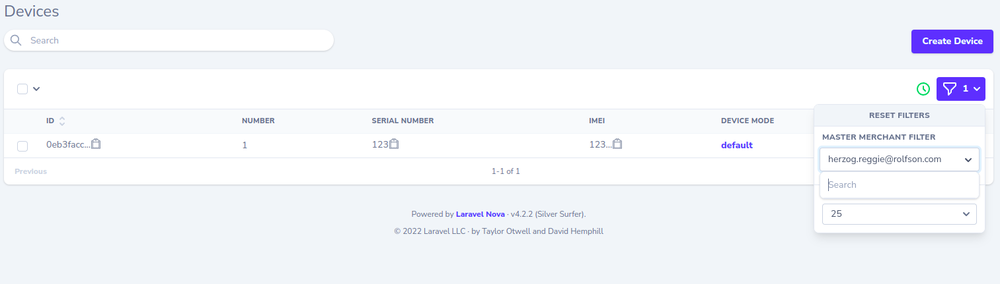

# nova-searchable-belongs-to-filter
Searchable Nova filter for belongsTo relationships.

### Demo



### Prerequisites

This package assumes you have a text-search setup for your Eloquent models. See [Laravel Scout](https://laravel.com/docs/master/scout).

### Installation

`composer require khalin/nova4-searchable-belongs-to-filter`

### Usage

For this example let's assume a user belongs to a department and a department has many users.
To make the relationship searchable via a filter, add this to the `filters()` function of your Nova user resource:

By default the filter will display the name of the `fieldAttribute` you passed on instantiation. You can customize the name by passing it as an argument to the filter's construct function, for example `my-new-name`.

```php
// app/Nova/User.php

use Khalin\Nova4SearchableBelongsToFilter\NovaSearchableBelongsToFilter

public function filters(Request $request)
{
    return [
	(new NovaSearchableBelongsToFilter('my-new-name'))
	    ->fieldAttribute('department')
	    ->filterBy('department_id')
    ];
}
```
